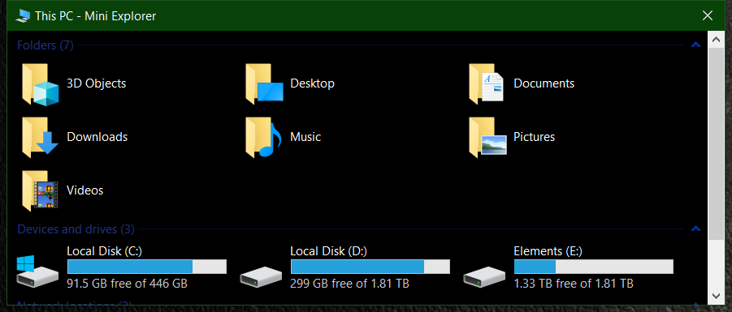

<!--  MiniExplorer -->
 MiniExplorer
==========

A small explorer window without all the fluff


[](https://github.com/RadAd/MiniExplorer/releases/latest)
[](commits/master)
[](https://ci.appveyor.com/project/RadAd/MiniExplorer)



Build
=======
```bat
msbuild MiniExplorer.vcxproj -p:Configuration=Release -p:Platform=x64
```
